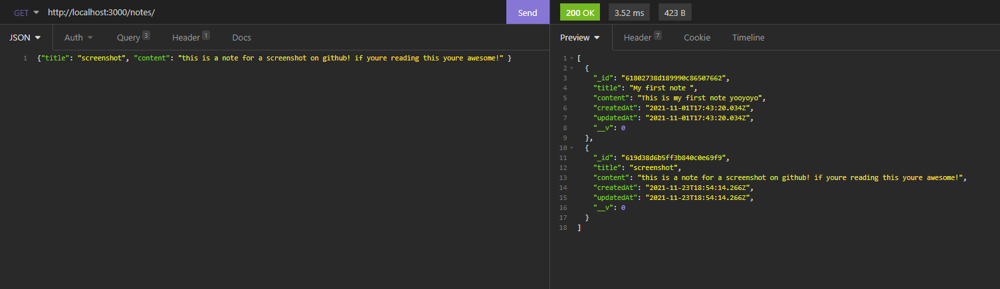

# Node Note Taker

## Table of Contents

[About](#About)
[Project](#Project)

# About -

#### GitHub User: imjord

#### User Email: dean.jay.goat@gmail.com

# Project -

## Project Name: Backend Note Taker

#### Project Description: You can create backend requests to create a note, delete, update, and search notes created.

##### Repo License:

#### Repo Info: You will need insomina or postman to see the routes working for yourself. Made with <3 imjord

#### Badge:

